Model comparison and local updates
==================================

Updated: 2020-07-29

This page describes the model comparison feature of Papyrus Compare in Papyrus CX for AXCIOMA.

For a general guide of this feature, including configuration, limitations and other operations, see [Model diff/merge in Papyrus CX for AXCIOMA](papyrus-compare-guide.md).

We describe here the "Compare Editor" as used in the following scenarios:

1. Comparing two models from the workspace.
1. Comparing a model in the workspace with a model in some commit in its git repository history, and possibly updating the local (workspace) model with changes from the repository version.

Table of Contents
-----------------

* [Launching a comparison](#launching-a-comparison)
* [User Interface Overview](#user-interface-overview)
* [The full Compare Editor view](#the-full-compare-editor-view)
    * [The toolbar](#the-toolbar)
    * [The top panel (structural differences overview)](#the-top-panel-structural-differences-overview)
       * [Alternative grouping of changes](#alternative-grouping-of-changes)
       * [Filters](#filters)
       * [Displaying change consequences](#displaying-change-consequences)
    * [Bottom panels](#bottom-panels)
       * [Structural differences](#structural-differences)
       * [Diagram differences](#diagram-differences)
       * [Common ancestor](#common-ancestor)
* [Basic usage](#basic-usage)
    * [Navigating through differences](#navigating-through-differences)
    * [Accepting and rejecting changes](#accepting-and-rejecting-changes)

Launching a comparison
----------------------

Papyrus Compare allows you to compare two models from the workspace, or a model from the workspace with a model in some commit in a git repository. Currently, comparing models between two commits is not fully supported.

To compare two models from the workspace, select both models in the Project Explorer, and then right-click and select "Compare With &rarr; Each other (EMF Compare)" (\*) as shown below:

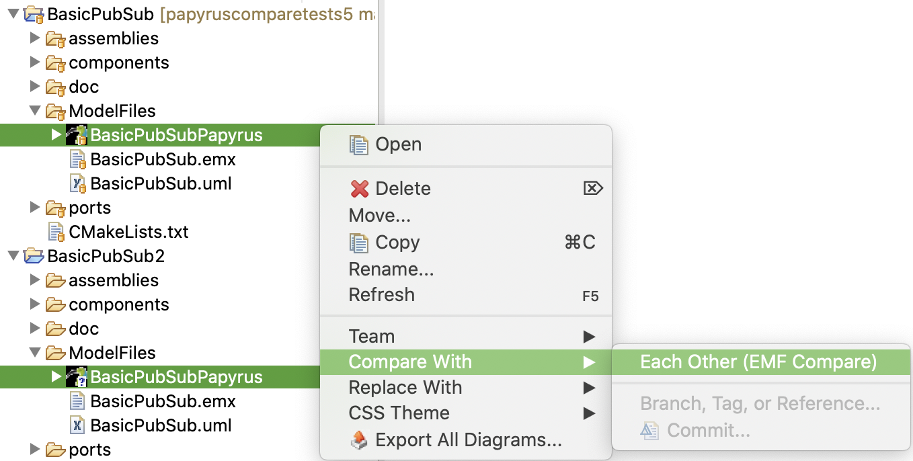

(\*) You can ignore the "(EMF Compare)" part of the label. The same menu item is used for both Papyrus Compare and plain EMF Compare.

To compare a model from the workspace with a version from its git repository, select the model in the Project Explorer, then right-click and select "Compare With" and then choose between "HEAD Revision", "Index", "Previous Revision", "Branch, Tag, or Reference..." or "Commit...", as shown below:

Note that you can only compare a model in the workspace with a version in some git repository if the model in question has been checked out from that repository.

If you select "Compare With &rarr; Branch, Tag, or Revision..." you will see the following dialog to choose a branch, tag or revision:

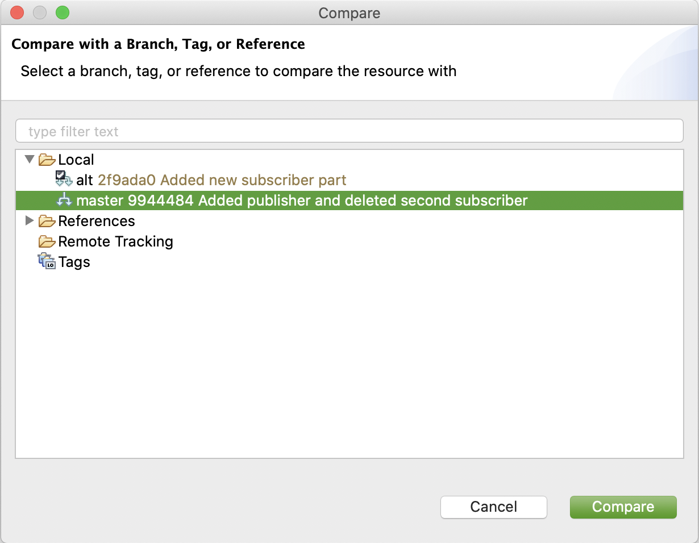

If you select "Compare With &rarr; Commit..." you will see the following dialog to choose a commit from the git repository's history:

When comparing with a model in a git repository, you might be prompted to confirm opening the "Synchronization" perspective:

You can check the "Remember my decision" checkbox to avoid being prompted in the future.

In the "Synchronization" perspective you should see the "Synchronize" view on the left-hand site, listing the projects and resources with changes as shown below (you may have to unfold the projects and folders to see the actual files listed):

To see the comparison, either double-click on a .uml file or a .notation file, or select a file, right-click and then "Open in Compare Editor":

User Interface Overview
-----------------------

When a comparison is launched, the Comparison Viewer will appear. It will take some time while it computes the differences.

Once it has finished computing the differences, the view will show them:

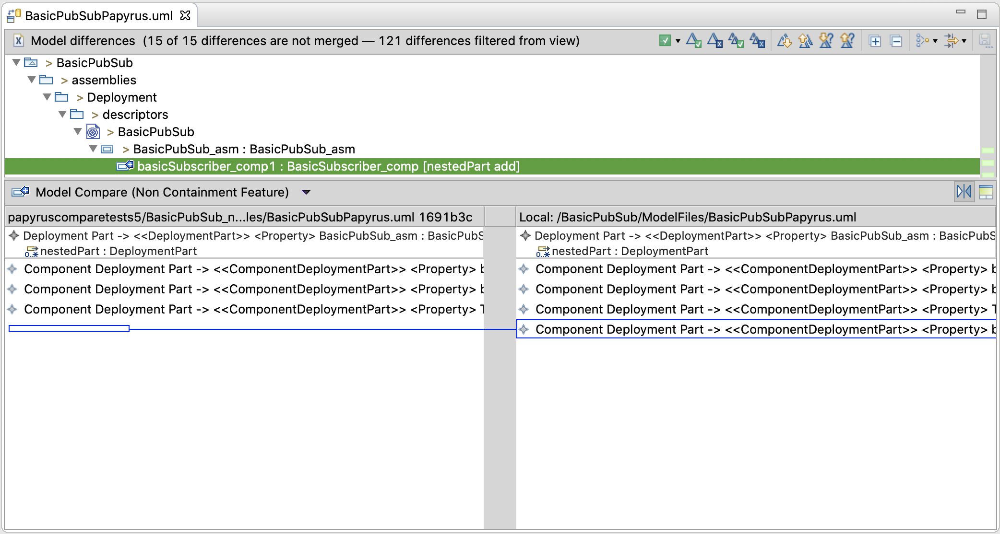

### The full Compare Editor view

This view is made up of several parts as shown below:

(1) [The toolbar](#the-toolbar): shows the number of differences and provides buttons for accepting/rejecting changes, navigating through differences, choosing alternative views and filters.

(2) [The top panel (structural differences overview)](#the-top-panel-structural-differences-overview): this shows a structural overview of the differences, according to the models' structure.

(3) and (4): [Bottom panels](#bottom-panels): It shows the two versions of the currently selected element being compared. It will show the relevant elements in their context. These panels might show either a structural view or a diagram view for diagram differences.

(5) Comparison selector: by default it is set to "Model Compare", but it can be changed to "Text Compare" (to compare the underlying XMI) or to "Properties Compare".

(6) Buttons to switch left and right panes, and a button to show their common ancestor when performing a three-way comparison. (Comparing models in a git repository is a three-way comparison).

### The toolbar

The toolbar contains buttons for the main actions to perform:

The left part of the toolbar shows the number of differences found, including differences that may be hidden (more on filters later).

The right part of the toolbar contains several buttons with different actions that can be taken:

(1) Show consequences of accepting (or rejecting) the currently selected change. This highlights in the top panel (and its right border) all other changes that are implied by the selected change.

(2), (3), (4) and (5): [Accepting and rejecting changes](#accepting-and-rejecting-changes):

(2) Accept the currently selected change (and those changes implied by it).

(3) Reject the currently selected change.

(4) Accept all non-conflicting changes: the changes on the left will be accepted and the changes from the right will be merged into the left-hand model.

(5) Reject all non-conflicting changes: the changes on the left will be rejected and the changes on the right will not be used.

(6), (7), (8) and (9): [Navigating through differences](#navigating-through-differences):

(6) Go to the next difference.

(7) Go to the previous difference.

(8) Go to the next unresolved difference.

(9) Go to the previous unresolved difference.

(10) Expand (unfold) all differences in the top panel.

(11) Collapse (fold) all differences in the top panel.

(12) Groups: group differences by side (all left changes first), by kind (additions first, then deletions, then other updates), or by resource. (See [Alternative grouping of changes](#alternative-grouping-of-changes).)

(13) Filters: allows the user to choose which filters are applied to simplify the structural view (e.g. filter "Technical elements"). By default all built-in filters are applied. (See [Filters](#filters).)

### The top panel (structural differences overview)

The top panel ((2) in the screenshot above) shows the main differences between the two models as a tree matching the structure of the models, given by the containment relation between its elements.  Only the parts of the tree that contain changes will be displayed.

This tree view is the main tool to navigate through the model changes and each node can be folded and unfolded by clicking on the small dark triangle on its left.

| Unfolded | Folded |
| -- | -- |
|  |  |

This view shows each change in a line as follows:

The change line is broken down into the following parts:

(1) Icon with decorator: the icon corresponds to the kind of element (e.g. component or attribute) and the decorator corresponds to the kind of change (see below).

(2) Element name.

(3) Element type.

(4) Change label: a description of the kind of change (addition, deletion).

The decorators are interpreted as follows:

| Decorator                         | Description                                             |
| ---------------------------- | ------------------------------------------------------- |
|   | Incoming differences are changes that were made in the right-side model since the last common ancestor. |
|  | Outgoing differences are changes that were made in the left-side model since the last common ancestor. |
|  | Incoming addition represents an incoming addition difference, this is, an element that doesn't exist in the left-side has been added to the right-side model. |
|  | Incoming deletion represents an incoming deletion difference, this is, an element that exists in the left-side has been deleted in the right-side model. |
|  | Outgoing addition represents an outgoing addition difference, this is, an element that doesn't exist in the right-side has been added to the left-side model. |
|  | Outgoing deletion represents an outgoing deletion difference, this is, an element that exists in the right-side has been deleted in the left-side model. |
|  | Incoming conflict differences are changes that were made in the right-side  model, and are in conflict with the left-side model. |
|  | Outgoing conflict differences are changes that were made in the left-side model, and are in conflict with the right-side model. |
|  | Incoming addition conflict. |
|  | Incoming deletion conflict. |
|  | Outgoing addition conflict. |
|  | Outgoing deletion conflict. |

**Tip:** *Sometimes it is useful to enable the common ancestor view (button 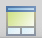) to understand the additions and deletions since the commit's common ancestor.*

#### Alternative grouping of changes

This view can be customized by changing the way the changes are grouped, by clicking the "Groups" button: .

The meaning of these grouping options is as follows:

* Default (Papyrus): shows the changes following the tree structure of the model with diagram element changes in their container elements.
* By Side: puts all conflicts (if any) first, then changes in the left-side model, followed by all changes in the right-side model.
* Default: shows the default EMF Compare view, showing diagram element changes separate from the structural changes.
* By Kind: puts all conflicts (if any) first, then additions, then all deletions, then other changes such as attribute updates, and then moves.
* By Resource: organizes changes according to the resource affected.

For example, setting this to "By Kind" yields the following in the sample model:

#### Filters

This view can also be customized by applying or removing filters, by clicking the "Filters button":  .

By default all filters are applied, yielding the smallest change-set for the current comparison. Disabling (unchecking) one or more filters, will display more details and structure.

**Tip:** *When a particular change seems unexpected or unexplained, or it is unclear where it comes from, it is useful to uncheck one or more of these filters to obtain more details.*

#### Displaying change consequences

A particular change may imply or require other changes. By default, the structural viewer highlights the changes implied or required by the currently selected change if the change is accepted, in a lighter colour than the selected change. For example:

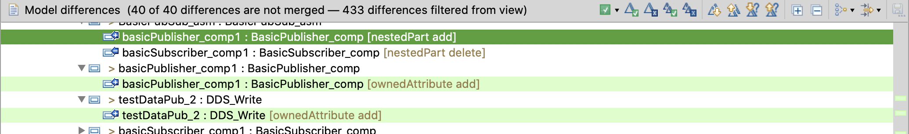

Note that the scrollbar on the right shows also the position of the highlighted elements. By clicking on any of this you can jump directly to that change.

The "Consequences" button () can be used to show the consequences of either accepting or rejecting the change, or not to show consequences at all:

Each of the consequences of the currently selected change, are highlighted in green and red.

* The consequences highlighted in green are the differences that will be merged (accepted) automatically when the selected difference is accepted or merged.
* The consequences highlighted in  red are the differences that will be not "mergeable" after the merge of the selected difference.

### Bottom panels

#### Structural differences

Structural differences are displayed in the left and right panels below the top panel:

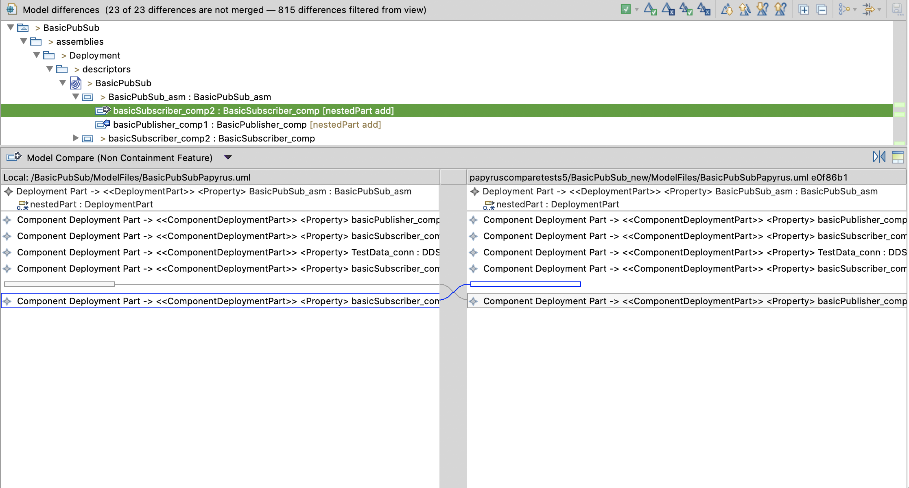

These panels show the tree structure of the models being compared, and the elements containing nested elements can be folded and unfolded as with the top panel.

By default the "local" (i.e. workspace) model will be displayed on the left-side panel and the "read-only" model (from another commit) will be on the right, but these can be swapped using the "swap" button (), (4) in the screenshot below.

If unsure as to which side corresponds to which model, you can check the labels on top of the left and right panels. The label will include the commit hash (1) which can be seen in the history view (2), or it will state that it is the local (workspace) version (3). The screenshot below shows the left and right swapped, with the "local" model on the right and the other commit on the left:

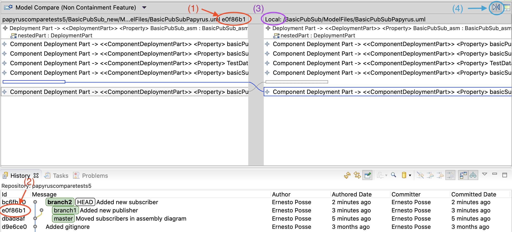

<!-- The changes are highlighted with different colours to represent different things. This follows the same convention as decorators described above:

| Change colour                          | Meaning |
| -------------------------------------- | ------- |
| Blue   | Incoming change |
| Black | Outgoing change |
| Red     | Conflict        |

Note however that sometimes the colour of these changes in the bottom panels may be swapped. This seems to be a bug in EMF Compare.

The currently selected change is highlighted with a darker border. -->

#### Diagram differences

Papyrus models consist of a structural part (stored in a .uml file) and a set of diagrams associated with the structural elements (stored in a .notation file). When comparing models with changes in some diagram, these differences are shown in the Compare Editor, both in the top panel (under Model differences), and in the bottom left and right panels as diagrams:

The top (structural overview) panel shows the structural view of the diagram elements, e.g. a "Shape" inside a "Compartment" inside another "Shape", etc.

The bottom left and right panels will show the actual diagrams, with the elements changed highlighted according to the type of change.

#### Common ancestor

It is sometimes useful to see the common ancestor of two models from their git history. This can be enabled with the  button:

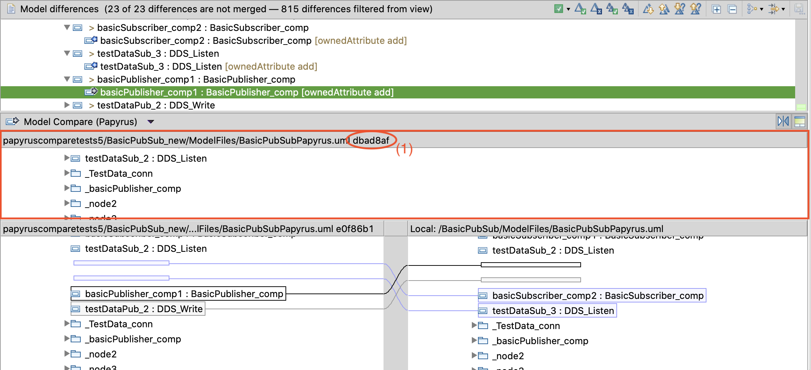

This view also shows the commit hash for the common ancestor (1).

Basic usage
-----------

### Navigating through differences

The basic mechanism to navigate through the differences is using the following toolbar buttons:

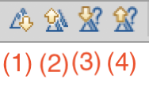

(1) Go to the next difference.

(2) Go to the previous difference.

(3) Go to the next unresolved difference. (\*)

(4) Go to the previous unresolved difference. (\*)

(\*) Unresolved differences are differences that have been neither accepted nor rejected. See [Accepting and rejecting changes](#accepting-and-rejecting-changes).

Clicking on any of these buttons will automatically show the relevant elements in context in the [bottom panels](#bottom-panels).

### Accepting and rejecting changes

In this mode, it is possible to update the local (workspace) model (by default the left-side), with changes from the "remote" or repository version (by default the right-side). Incorporating this changes is done with the following toolbar buttons:

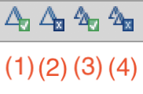

(1) Accept the currently selected change (and those changes implied by it).

(2) Reject the currently selected change.

(3) Accept all non-conflicting changes: the changes on the left will be accepted and the changes from the right will be merged into the left-hand model.

(4) Reject all non-conflicting changes: the changes on the left will be rejected and the changes on the right will not be used.

Accepting a change does not affect the "read-only" version of the model. Additions, deletions, updates and moves will be applied only to the local version (left-side by default).

Note that accepting a change may entail accepting several changes at once, as some changes may imply or require other changes because of the structural constraints of the model. To see all the changes implied by the selected change, please refer to [displaying change consequences](#displaying-change-consequences).

Rejecting a change will not modify either side in this mode.

After a change has been accepted, it will be marked as "resolved" or "merged", and the icon decorator will change to one of the following, depending on whether the change was accepted or rejected:

| Resolution decorator                        | Description |
| ------------------------------------------- | ----------- |
|    | The change was accepted. The local copy has been updated. |
|   | The change was rejected. The local copy has *not* been updated. |

For example:

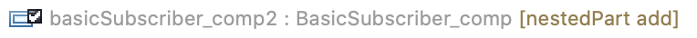

The change label will also be greyed out.

#### Conflicts

There are many reasons why two changes might be in conflict. For example the left-side might be changing the value or visibility of an attribute while the right-side changes the same attribute to a different value or its visibility.

In such cases, the top-panel will show two lines with the conflicting change.

The user must choose which side to accept, or reject. However, accepting the change coming from one side will make the other change "unmergeable".

#### Saving after changes

Once all changes have been resolved, saving the model (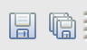 on the main Eclipse toolbar) may show the following pop-up, asking if you want to stage the modified files (git add):

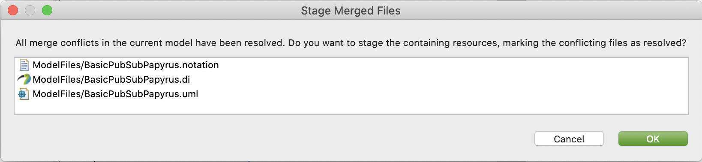
