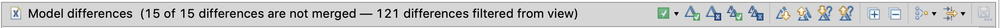

Model comparison and local updates
==================================

Updated: 2020-07-27

This page describes the model comparison feature of Papyrus Compare in Papyrus CX for AXCIOMA. For a general guide of this feature, including configuration, limitations and other operations, see [Model diff/merge in Papyrus CX for AXCIOMA](papyrus-compare-guide.md).

We describe here the "Compare Editor" as used in the following scenarios:

1. Comparing two models from the workspace.
1. Comparing a model in the workspace with a model in some commit in its git repository history, and possibly updating the local (workspace) model with changes from the repository version.

Table of Contents
-----------------

* [Launching a comparison](#launching-a-comparison)
* [User Interface Overview](#user-interface-overview)
    * [The full Compare Editor view](#the-full-compare-editor-view)
    * [The toolbar](#the-toolbar)
    * [The top panel (structural overview)](#the-top-panel-structural-overview)
       * [Alternative grouping of changes](#alternative-grouping-of-changes)
       * [Filters](#filters)
       * [Displaying change consequences](#displaying-change-consequences)
    * [Diagram differences](#diagram-differences)
    * [Structural differences](#structural-differences)

Launching a comparison
----------------------

Papyrus Compare allows you to compare two models from the workspace, or a model from the workspace with a model in some commit in a git repository. Currently, comparing models between two commits is not fully supported.

To compare two models from the workspace, select both models in the Project Explorer, and then right-click and select "Compare With &rarr; Each other (EMF Compare)" as shown below:

To compare a model from the workspace with a version from its git repository, select the model in the Project Explorer, then right-click and select "Compare With" and then choose between "HEAD Revision", "Index", "Previous Revision", "Branch, Tag, or Reference..." or "Commit...", as shown below:

Note that you can only compare a model in the workspace with a version in some git repository if the model in question has been checked out from that repository.

If you select "Compare With &rarr; Branch, Tag, or Revision..." you will see the following dialog to choose a branch, tag or revision:

If you select "Compare With &rarr; Commit..." you will see the following dialog to choose a commit from the git repository's history:

When comparing with a model in a git repository, you might be prompted to confirm opening the "Synchronization" perspective:

You can check the "Remember my decision" checkbox to avoid being prompted in the future.

In the "Synchronization" perspective you should see the "Synchronize" view on the left-hand site, listing the projects and resources with changes as shown below (you may have to unfold the projects and folders to see the actual files listed):

To see the comparison, either double-click on a .uml file or a .notation file, or select a file, right-click and then "Open in Compare Editor":

User Interface Overview
-----------------------

When a comparison is launched, the Comparison Viewer will appear. It will take some time while it computes the differences.

Once it has finished computing the differences, the view will show them:

### The full Compare Editor view

This view is made up of several parts as shown below:

(1) Toolbar: shows the number of differences and provides buttons for accepting/rejecting changes, navigating through differences, choosing alternative views and filters.

(2) The structural differences overview: this shows a structural overview of the differences, according to the models' structure.

(3) and (4): The two versions being compared. By default, the "remote", repository or read-only version is on the left-hand side, and the workspace version on the right hand side, but this can be switched with the first button in (6).

(5) Comparison selector: by default it is set to "Model Compare", but it can be changed to "Text Compare" (to compare the underlying XMI) or to "Properties Compare".

(6) Buttons to switch left and right panes, and a button to show their common ancestor when performing a three-way comparison.

### The toolbar

The toolbar contains buttons for the main actions to perform:

The left part of the toolbar shows the number of differences found, including differences that may be hidden (more on filters later).

The right part of the toolbar contains several buttons with different actions that can be taken:

(1) Show consequences of accepting (or rejecting) the currently selected change. This highlights in the top panel (and its right border) all other changes that are implied by the selected change.

(2) Accept the currently selected change.

(3) Reject the currently selected change.

(4) Accept all non-conflicting changes: the changes on the left will be accepted and the changes from the right will be merged into the left-hand model.

(5) Reject all non-conflicting changes: the changes on the left will be rejected and the changes on the right will not be used.

(6) Go to the next difference.

(7) Go to the previous difference.

(8) Go to the next unresolved difference.

(9) Go to the previous unresolved difference.

(10) Expand all differences in the top panel.

(11) Collapse all differences in the top panel.

(12) Groups: group differences by side (all left changes first), by kind (additions first, then deletions, then other updates), or by resource. (See [Alternative grouping of changes](#alternative-grouping-of-changes).)

(13) Filters: allows the user to choose which filters are applied to simplify the structural view (e.g. filter "Technical elements"). By default all built-in filters are applied. (See [Filters](#filters).)

### The top panel (structural overview)

The top panel ((2) in the screenshot above) shows the main differences between the two models as a tree matching the structure of the models, given by the containment relation between its elements.

This tree view is the main tool to navigate through the model changes and each node can be folded and unfolded by clicking on the small dark triangle on its left.

| Unfolded | Folded |
| -- | -- |
|  |  |

This view shows the changed elements with a little decorator and a label indicating the kind of change:

The change line is broken down into the following parts:

(1) Icon with decorator: the icon corresponds to the kind of element (e.g. component or attribute) and the decorator corresponds to the kind of change (see below).

(2) Element name

(3) Element type

(4) Change label: a description of the kind of change (addition, deletion).

The decorators are interpreted as follows:

| Decorator                         | Description                                             |
| ---------------------------- | ------------------------------------------------------- |
|   | Incoming differences are changes that were made in the right-side model since the last common ancestor. |
|  | Outgoing differences are changes that were made in the left-side model since the last common ancestor. |
|  | Incoming addition represents an incoming addition difference, this is, an element that doesn't exist in the left-side has been added to the right-side model. |
|  | Incoming deletion represents an incoming deletion difference, this is, an element that exists in the left-side has been deleted in the right-side model. |
|  | Outgoing addition represents an outgoing addition difference, this is, an element that doesn't exist in the right-side has been added to the left-side model. |
|  | Outgoing deletion represents an outgoing deletion difference, this is, an element that exists in the right-side has been deleted in the left-side model. |
|  | Incoming conflict differences are changes that were made in the right-side  model, and are in conflict with the left-side model. |
|  | Outgoing conflict differences are changes that were made in the left-side model, and are in conflict with the right-side model. |
|  | Incoming addition conflict. |
|  | Incoming deletion conflict. |
|  | Outgoing addition conflict. |
|  | Outgoing deletion conflict. |

**Tip:** Sometimes it is useful to enable the common ancestor view (button ) to understand the additions and deletions since the commit's common ancestor.

#### Alternative grouping of changes

This view can be customized by changing the way the changes are grouped, by clicking the "Groups" button: .

The meaning of these grouping options is as follows:

* Default (Papyrus): shows the changes following the tree structure of the model with diagram element changes in their container elements.
* By Side: puts all changes in the left-side model first, followed by all changes in the right-side model.
* Default: shows the default EMF Compare view, showing diagram element changes separate from the structural changes.
* By Kind: puts all additions first, then all deletions, and then other changes such as attribute updates.
* By Resource: organizes changes according to the resource affected.

For example, setting this to "By Kind" yields the following in the sample model:

#### Filters

This view can also be customized by applying or removing filters, by clicking the "Filters button":  .

By default all filters are applied, yielding the smallest change-set for the current comparison. Disabling (unchecking) one or more filters, will display more details and structure.

**Tip:** When a particular change seems unexpected or unexplained, or it is unclear where it comes from, it is useful to uncheck one or more of these filters to obtain more details.

#### Displaying change consequences

A particular change may imply or require other changes. By default, the structural viewer highlights the changes implied or required by the currently selected change if the change is accepted, in a lighter colour than the selected change. For example:

Note that the scrollbar on the right shows also the position of the highlighted elements. By clicking on any of this you can jump directly to that change.

The "Consequences" button () can be used to show the consequences of either accepting or rejecting the change, or not to show consequences at all:

Each of the consequences of the currently selected change, are highlighted in green and red.

* The consequences highlighted in green are the differences that will be merged (accepted) automatically when the selected difference is accepted or merged.
* The consequences highlighted in  red are the differences that will be not "mergeable" after the merge of the selected difference.

### Diagram differences

Papyrus models consist of a structural part (stored in a .uml file) and a set of diagrams associated with the structural elements (stored in a .notation file). When comparing models with changes in some diagram, these changes are shown in the Compare Editor, both in the top panel (under Model differences), and in the bottom left and right panels:

The top (structural overview) panel shows the structural view of the diagram elements, e.g. a "Shape" inside a "Compartment" inside another "Shape", etc.

The bottom left and right panels will show the actual diagrams, with the elements changed highlighted according to the type of change.

### Structural differences

For structural changes, the left and right panels show a structural view of the changes:

These panels show the tree structure of the models being compared, and the elements containing nested elements can be folded and unfolded as with the top panel.

The changes are highlighted with different colours to represent different things. The currently selected change is highlighted with a darker border.
