Model merging
=============

Updated: 2020-07-29

This page describes the model merging feature of Papyrus Compare in Papyrus CX for AXCIOMA.

For a general guide of this feature, including configuration, limitations and other operations, see [Model diff/merge in Papyrus CX for AXCIOMA](papyrus-compare-guide.md).

For a guide on using the Compare Editor and incorporating changes into a local (workspace) model without merging git branches, see [Model comparison and local updates](papyrus-compare-model-diff). It is strongly recommended that you read that guide before this one.

We describe here the "Compare Editor" as used in the following scenarios:

1. Merging two models from different branches in a git repository.

For comparing models from different branches the user must first checkout one of the branches, import it into the workspace and then follow the instructions found in [Model comparison and local updates](papyrus-compare-model-diff).

This guide assumes that the user is familiar with git and EGit, as well as basic modelling with Papyrus CX for AXCIOMA. [Model diff/merge in Papyrus CX for AXCIOMA](papyrus-compare-guide.md) for links to relevant documentation.

Basic merging
-------------

Access the Git History view by going to the Git perspective (Window &rarr; Perspective &rarr; Open Perspective &rarr; Other... &rarr; Git). Then, on the Git repository view on the left (also accessible through Window &rarr; Show View &rarr; Git Repositories), select the relevant git repository. Then go to the History view (it should be visible in the Git perspective, but it is also accessible through Window &rarr; Show View &rarr; History). Then you should see something like this:

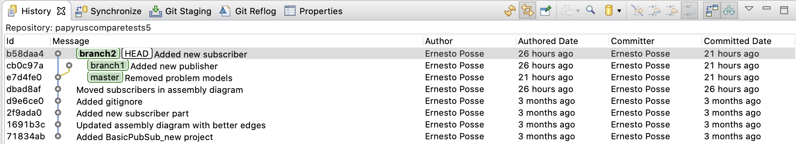

The currently checked-out branch (branch2 in this example) appears in bold.

Choose the "receiving" branch, i.e. the branch into which you want to merge another branch. Check out this "receiving" branch if it is not already checked-out. To do this, right-click on the chosen branch and then select "Checkout".

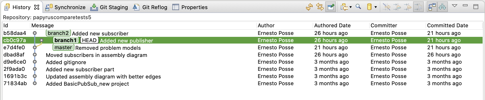

In this example, the "receiving" branch is "branch1", which has now been checked-out.

Once checked out, choose the other branch that you want to merge into the receiving branch. Then right-click and select "Merge".

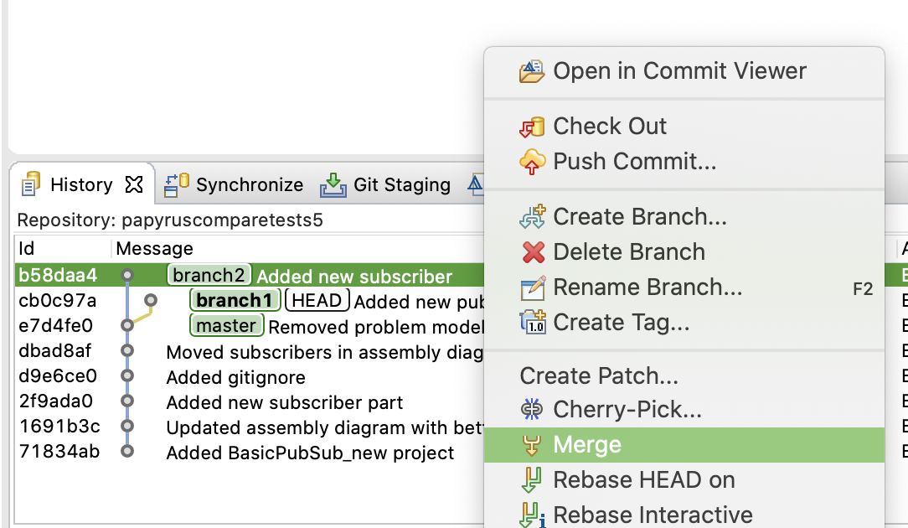

In this case we want to merge "branch2" into "branch1", so we checkout "branch1", select "branch2", right-click and then "Merge".

If there are no conflicts, the merge will be fully automatic and you will see the following pop-up as a result:

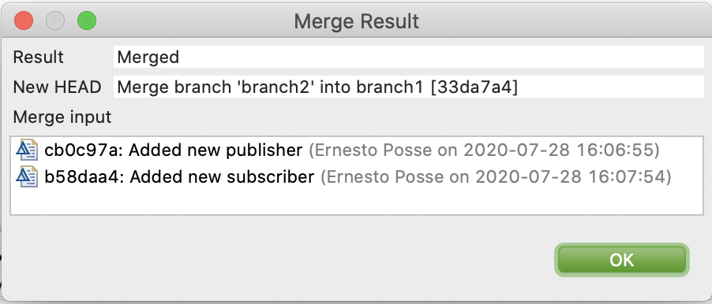

Then the history view should reflect the merge:

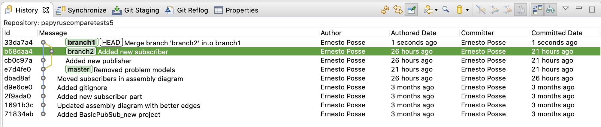

Conflicts
---------

Consider the case in which there are conflicting changes in the models you are trying to merge. For example, in this case, both models have a part called "basicSubscriber_comp1" whose visibility was "public" in the "master" branch, but was changed to "private" in "branch1" but to "protected" in "branch2".

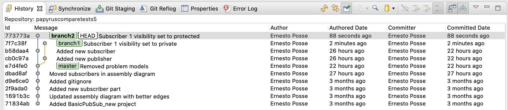

When attempting to merge, the merge will be interrupted and you will see the following pop-up:

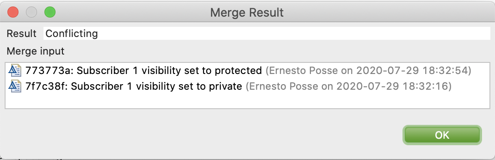

In this case, you must resolve the conflict(s) manually by going to the "Git Staging" view found in the bottom in the Git perspective, or accessible via Window &rarr; Show View &rarr; Other... &rarr; Git &rarr; Git Staging. You will see the resources (.uml and .notation) that have conflicts with a little red diamond. Right click on either a .uml or .notation file and select "Merge Tool":

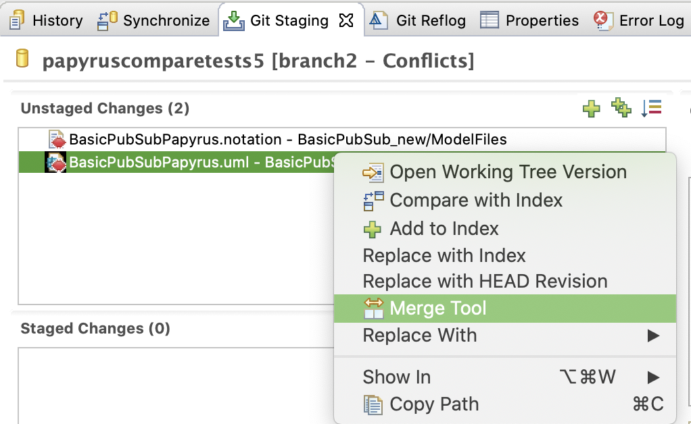

This will launch the merge tool which is very similar to the Compare Editor described in [Model comparison and local updates](papyrus-compare-model-diff.md), but with a few key differences:

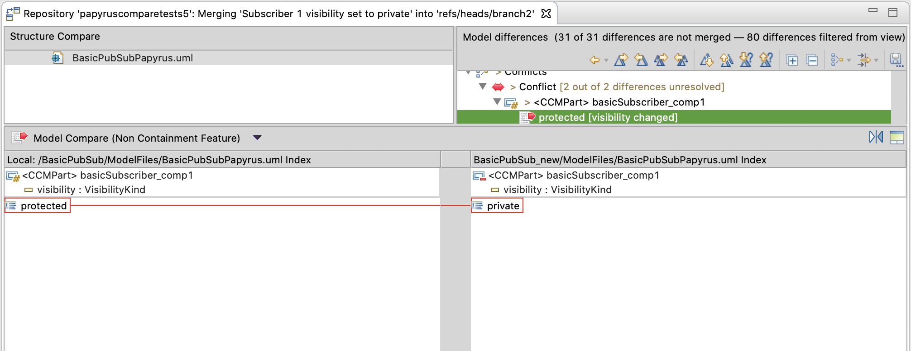

The top is divided now into two panels: a left-side and a right-side. The left-side titled "Structure Compare" displays the resource being compared. The right-side titled "Model differences" is like the top-panel in the Compare Editor, but with some different toolbar buttons, as described below.

Conflicts will be shown with two lines in the "Model differences", corresponding to the change on the left and the change on the right respectively. The icon has a red decorator representing a conflict as described in [Model comparison and local updates](papyrus-compare-model-diff.md#the-top-panel-structural-differences-overview). The bottom panels will show the relevant elements in context, with the conflicting elements highlighted in red.

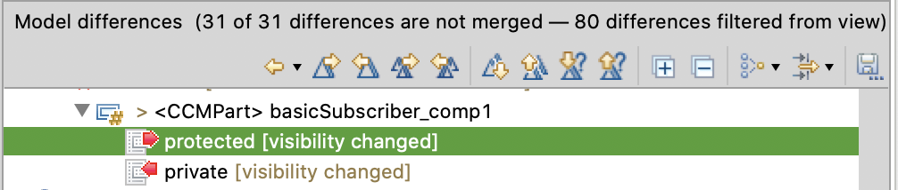

Note how the first line, representing the change on the left side, has its icon decorated with an outgoing (right-pointing) red decorator and the second line, representing the change on the right side, has its icon decorated with an incoming (left-pointing) ref decorator.

### Resolving Conflicts

For each conflict you must decide whether to take the left or the right side, and use the following buttons from the toolbar:

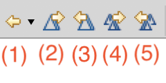

(1) Display consequences: this button is analogous to the first button in the Compare Editor tool, and will allow you to highlight the consequences of merging changes from left to right, right to left, or none.

(2) Apply the currently selected change from the left to the right. The left will remain unchanged, but the right side will be modified.

(3) Apply the currently selected change from the right to the left. The right will remain unchanged, but the left side will be modified.

(4) Apply all changes from the left on the right. The left side will remain unchanged and the right side will be modified.

(5) Apply all changes from the right on the left. The right side will remain unchanged and the left side will be modified.

**Tip:** *If you hover the mouse cursor over buttons (2) and (3), the tooltip will describe the effect of the button in your models.*

Once you select a change with a conflict and click one of the buttons above, the tool will automatically resolve the conflicting change (and all the ones implied by them) and change the decorator:

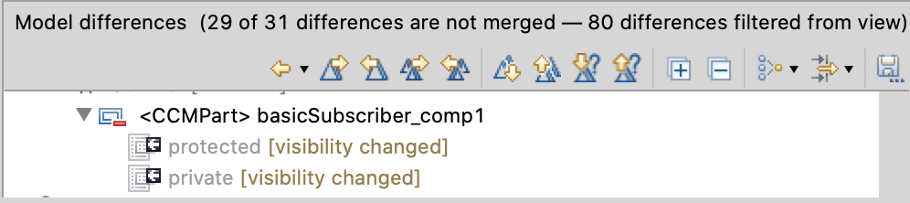

In this case, the second change (from the right side) was selected and button (3) was pushed.

In general, the changes will be given a decorator as follows:

| Resolution decorator                        | Description |
| ------------------------------------------- | ----------- |
|    | A change on the right-side has been incorporated into the left side. |
|  | A change on the left-side has been incorporated into the right side. |

Note however that there are cases that might lead to confusing results.  For example, in the case above, if we chose the first like (the outgoing change) that is, a change to "protected" on the left side, but click on button (3) to apply changes from the right onto the left, the result will be unexpected:

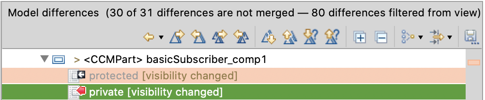

In this case, the second line was not automatically resolved, and is you see the bottom panels, you see that the left side was changed to "public", which is the value in the common ancestor:

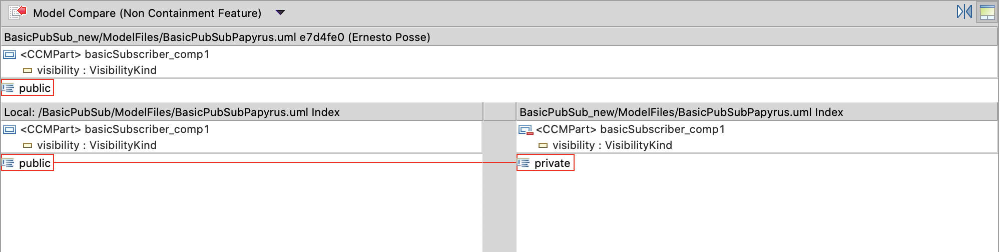

**Tip:** *If, when clicking one of the resolution buttons, one change is marked as resolved but the conflicting change isn't, it is likely that you pushed the wrong resolution button and that the conflict will not be resolved.*

You can get a summary of all merge actions in [EMF Compare User Guide - Merge actions recap](https://www.eclipse.org/emf/compare/documentation/latest/user/user-guide.html#Merge_actions_recap)
