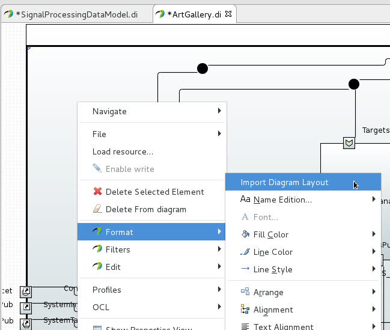

IBM RSA to Papyrus model migration guide
========================================

Updated: 2021-04-20

Table of Contents
-----------------

  * [Introduction](#introduction)
  * [Model migration](#model-migration)
  * [Diagram migration](#diagram-migration)

Introduction
------------
This guide will illustrate how to migrate a model from RSA(IBM Rational Software Architecture) to Papyrus.

Model migration
---------------

Here are steps to migrate the model from RSA to Papyrus.

1. In RSA, Export EMX model to UML model file using "Export Tools -> Export to UML" context menu

2. Open Papyrus. Right click on the UML file from the project explorer and run "Create CX Model from UML" context menu to create Papyrus model.

3. Open Papyrus model and Click "OK" to migrate profile. 

4. Migrate model using the "Model reactor -> Migrate model" menu.

5. Model migration is complete

Diagram migration
-----------------
The UML model generated from RSA contains diagram layout information for all composite structure diagrams.

Here are steps to migrate diagrams.

0. Set grid pixel size in the preference page for the best result. The default value in RSA is 12 pixels but it is 20 pixels in Papyrus. Migration produces better results when this value is set to 12 or smaller.

1. Create a composite structure diagram

2. This is the default diagram created.

3. Right click on the diagram and run the following menu to import layout

4. This is the result of migration

5. Once all diagrams are imported, run "Model refactor->Clean RSA diagrams" to clean RSA diagram information stored in the UML file. You do not want to check in the Papyrus model without removing this extra information on your UML file.

